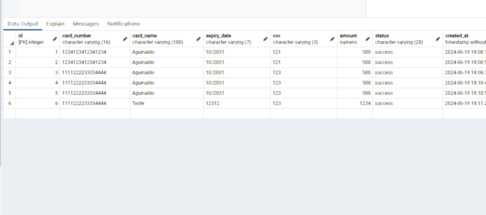

# API de Processamento de Pagamentos Fictícios

Esta é uma API de processamento de pagamentos fictícios construída com Node.js e Express, utilizando PostgreSQL para armazenamento de dados. A API permite a simulação de transações de pagamento, incluindo validação básica dos detalhes do cartão e armazenamento das transações no banco de dados.

## Tecnologias Utilizadas
- Node.js
- Express
- PostgreSQL
- Body-parser
- CORS

## Configuração do Ambiente

### Pré-requisitos
- Node.js
- PostgreSQL

### Instalação
1. Clone o repositório:
   ```sh
   git clone <URL_DO_REPOSITORIO>
   cd api-pagamentos
   ```

2. Instale as dependências:
   ```sh
   npm install
   ```

3. Configure o banco de dados PostgreSQL:
   - Certifique-se de que o PostgreSQL está instalado e em execução.
   - Crie um banco de dados chamado `apiPagamentos`.
   - Configure as credenciais do banco de dados no arquivo `db.js`.

4. Crie a tabela de transações:
   ```sql
   CREATE TABLE transactions (
     id SERIAL PRIMARY KEY,
     card_number VARCHAR(16) NOT NULL,
     card_name VARCHAR(100) NOT NULL,
     expiry_date VARCHAR(5) NOT NULL,
     cvv VARCHAR(3) NOT NULL,
     amount NUMERIC NOT NULL,
     status VARCHAR(20) NOT NULL,
     created_at TIMESTAMP DEFAULT CURRENT_TIMESTAMP
   );
   ```

### Execução
Inicie o servidor:
```sh
node server.js
```

O servidor estará em execução na porta `5000`.

## Endpoints

### Processar Pagamento Fictício
- **URL**: `/api/process-payment`
- **Método**: `POST`
- **Descrição**: Processa um pagamento fictício e armazena a transação no banco de dados.
- **Requisição**:
  ```json
  {
    "cardNumber": "string",
    "cardName": "string",
    "expiryDate": "string",
    "cvv": "string",
    "amount": "number"
  }
  ```
- **Resposta**:
  ```json
  {
    "message": "Pagamento realizado com sucesso",
    "status": "success",
    "transactionId": "number",
    "transactionDetails": {
      "cardName": "string",
      "amount": "number",
      "status": "success",
      "createdAt": "string"
    }
  }
  ```
### Banco de dados


## Estrutura de Diretórios
- `server.js`: Arquivo principal que configura o servidor Express e os endpoints.
- `db.js`: Configuração da conexão com o banco de dados PostgreSQL.

## Contato
Para mais informações, entre em contato:
- **Email**: tiaguinaldo2016@gmail.com
- **LinkedIn**: [Aguinaldo Borges](https://www.linkedin.com/in/aguinaldo-borges-dev/)
- **GitHub**: [AguinaldoBorges](https://github.com/AguinaldoBorges)
```